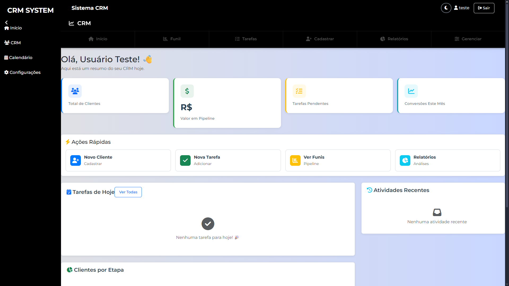
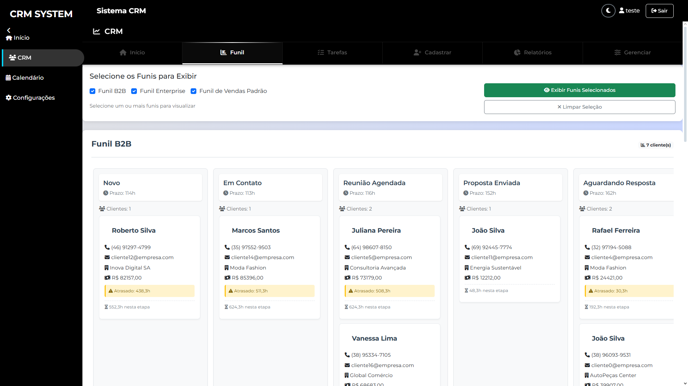

# Django CRM Template
Um sistema completo de CRM (Customer Relationship Management) construído com **Django** para gerenciamento de vendas, clientes, tarefas e pipeline comercial.



## Funcionalidades:

-Kanban board interativo (drag & drop)

-Atividades e Notas

-Prazos configuráveis por etapa

-Visão geral com métricas do pipeline

-Múltiplos funis simultâneos


Dados totalmente ficticios para ilustraçao!

## Estrutura do projeto
```bash
crm_template/
├── apps/
│   ├── crm/                    # App principal CRM
│   │   ├── models.py           # Modelos de dados
│   │   ├── views.py            # Views e lógica de negócio
│   │   ├── admin.py            # Interface administrativa
│   │   ├── forms.py            # Formulários
│   │   ├── urls.py             # URLs do aplicativo
│   │   ├── utils.py            # Funções auxiliares
│   │   └── migrations/         # Migrações de banco
│   ├── calendario/             # Módulo de calendário
│   └── home/                   # Dashboard principal
├── backend/
│   ├── settings.py             # Configurações do projeto
│   └── urls.py                 # URLs principais
├── frontend/
│   ├── static/                 # Arquivos estáticos
│   │   ├── css/
│   │   └── js/
│   └── templates/              # Templates HTML
│       ├── crm/                # Templates do CRM
│       └── base.html           # Template base
├── requirements.txt            # Dependências
├── manage.py                 
└── db.sqlite3                  # Banco de dados
```


## Para rodar o projeto:

### 1. Instalar dependências
```bash
pip install -r requirements.txt
```

### 2. Executar migrações
```bash
python manage.py migrate
```

### 3. Criar usuário
```bash
python manage.py createsuperuser
```

### 4. Popular com dados de exemplo (Opcional)
```bash
python populate_crm.py
```

### 5. Iniciar servidor
```bash
python manage.py runserver
```

Ferramentas utilizadas:

Backend: Python, Django 5.2.7

Banco de dados: SQLite 

Frontend: HTML, CSS, JavaScript

Bibliotecas: Django REST Framework, Pandas, ReportLab


